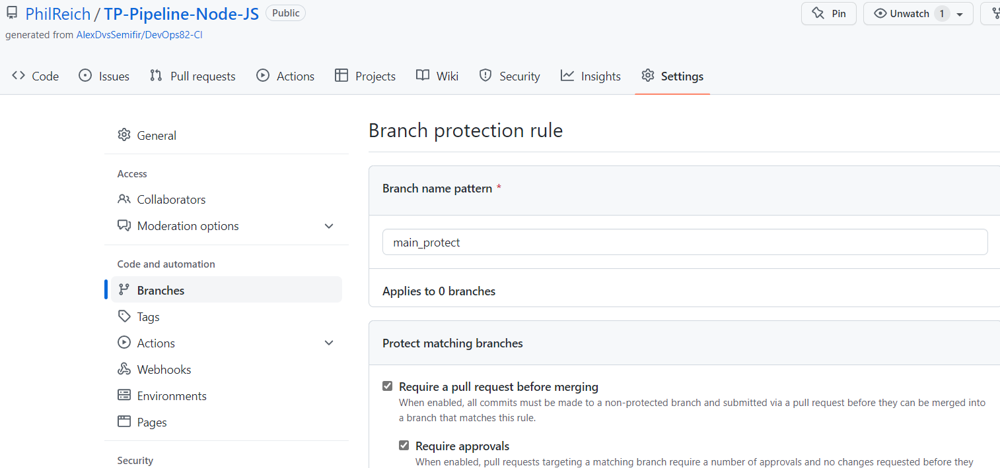
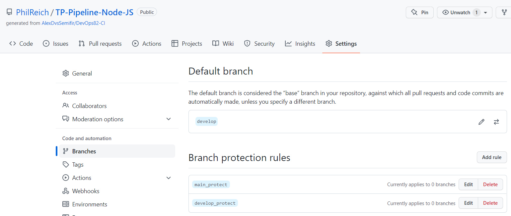

# Demo-CI
## TP_Pipeline_Node-JS

- NF7-DO-01:
- Mettez en place une protection sur la branche main, afin d'obliger les développeurs à utiliser des PullRequests

Protection de la branche main via des Pull Requests:
(Paramètres/ Branches/ Branch protection rules/ Add rules / cocher "require a pull request before merging"

- NF7-DO-02:
- Mettez en place une protection sur la branche develop, afin d'obliger les développeurs à utiliser des PullRequests

Même procédure que pour le NF7-DO-01 après avoir créé la branche develop:

 
- NF7-DO-03
- Mettez en place la pipeline de validation des conventionnal commits sur toutes les branches features/ et hotfix/. Le worflow doit s'exécuter lors des push.

- 
- NF7-DO-04
- 
- NF7-DO-05
- 
- NF7-DO-06
- 
- NF7-DO-07
- 
- NF7-DO-08

